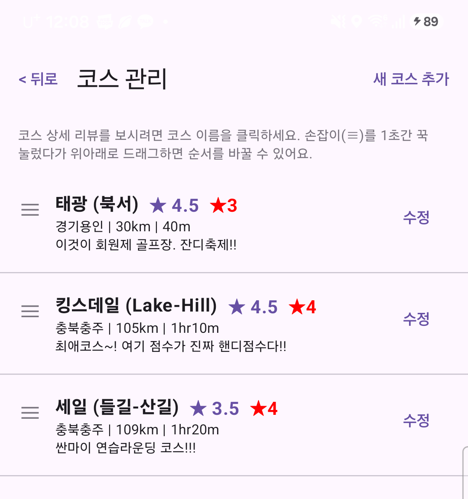
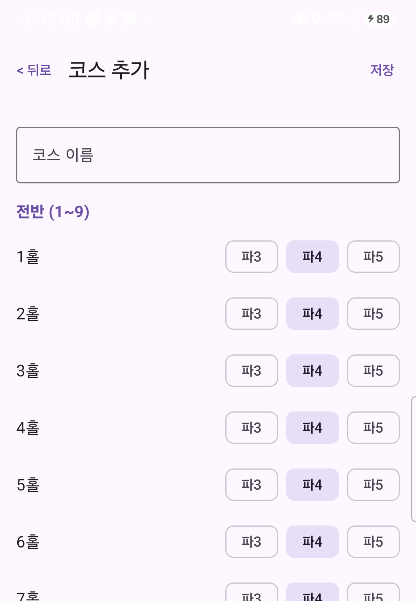
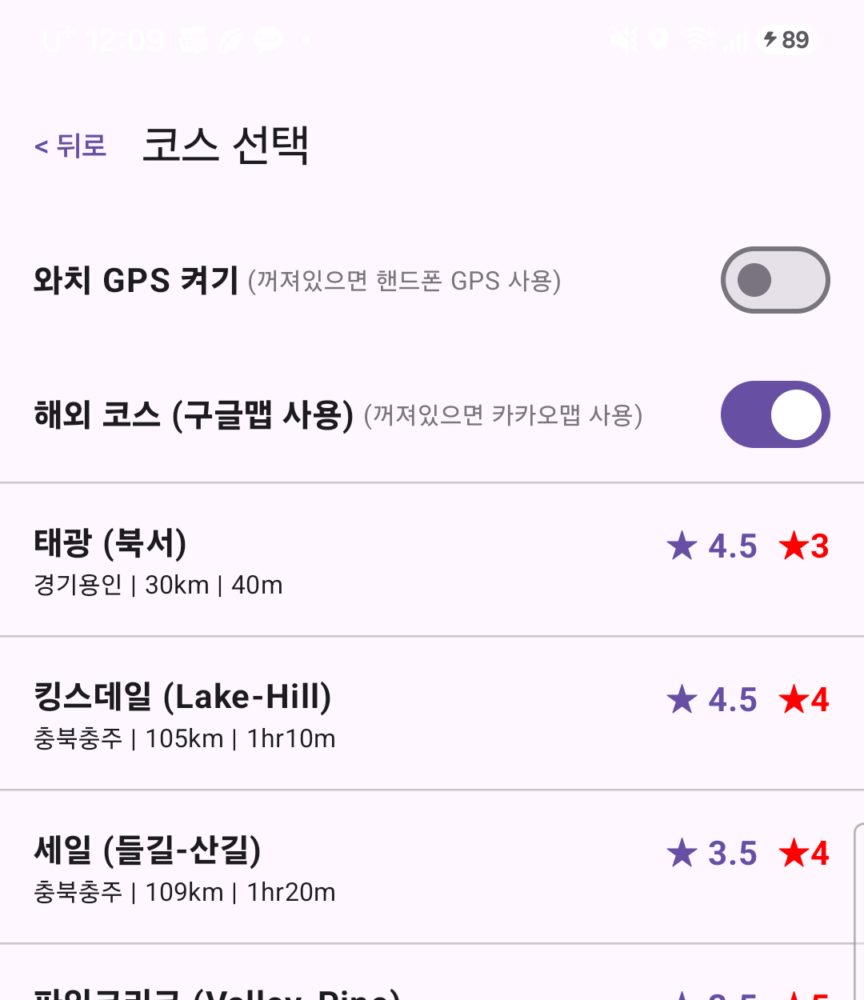
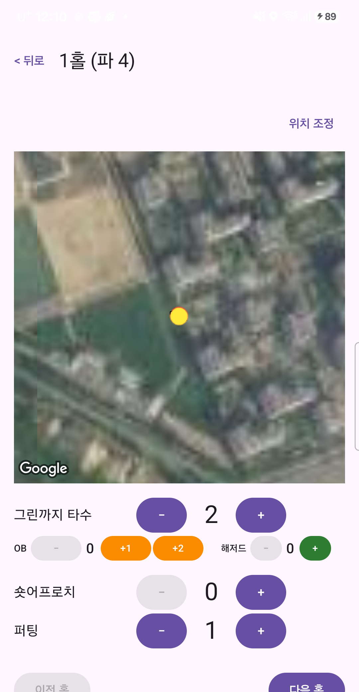
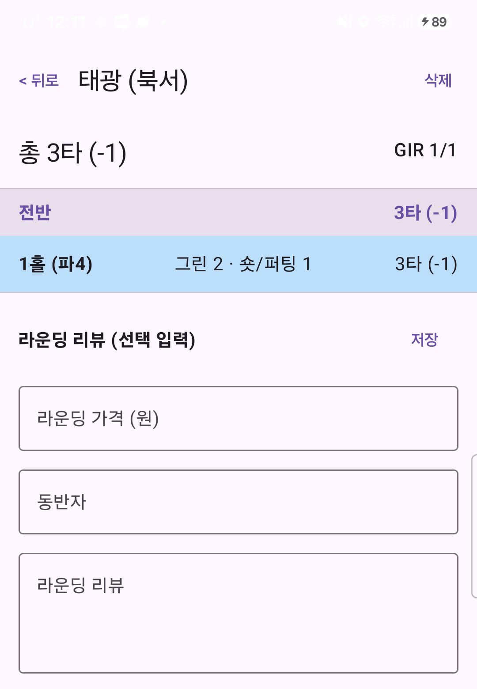
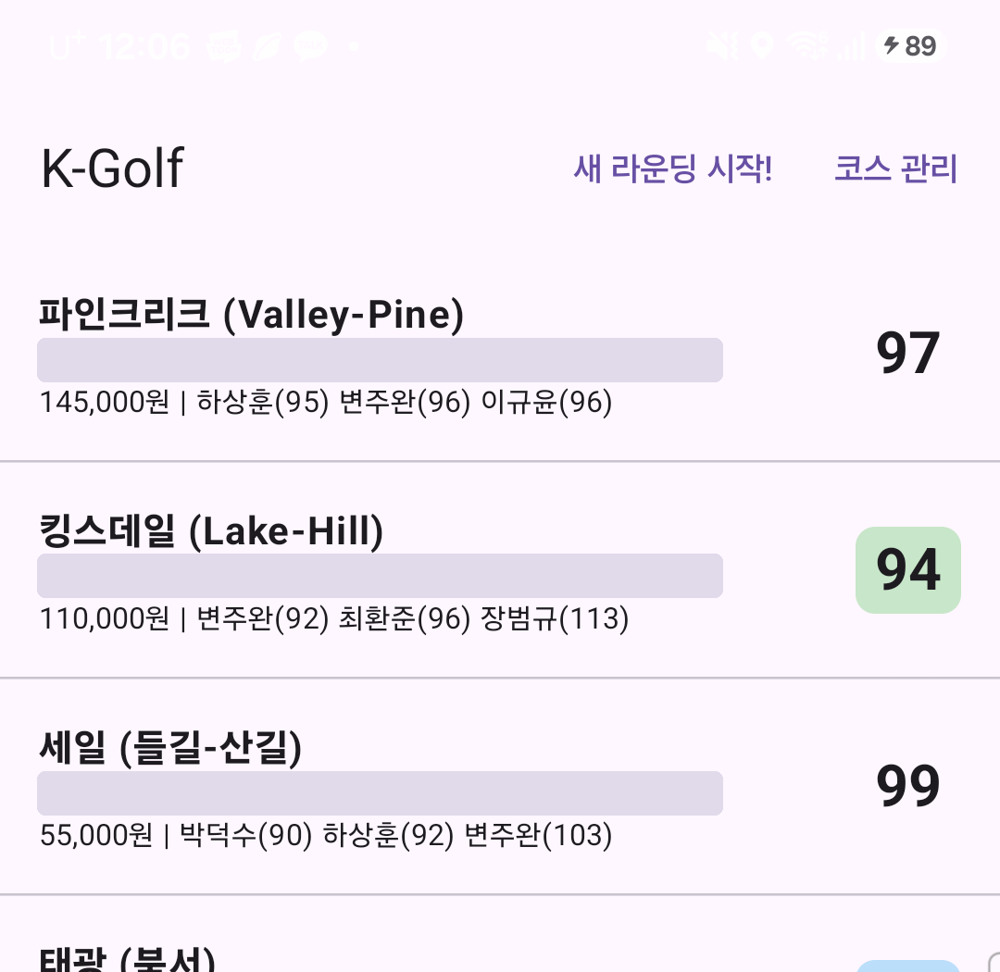
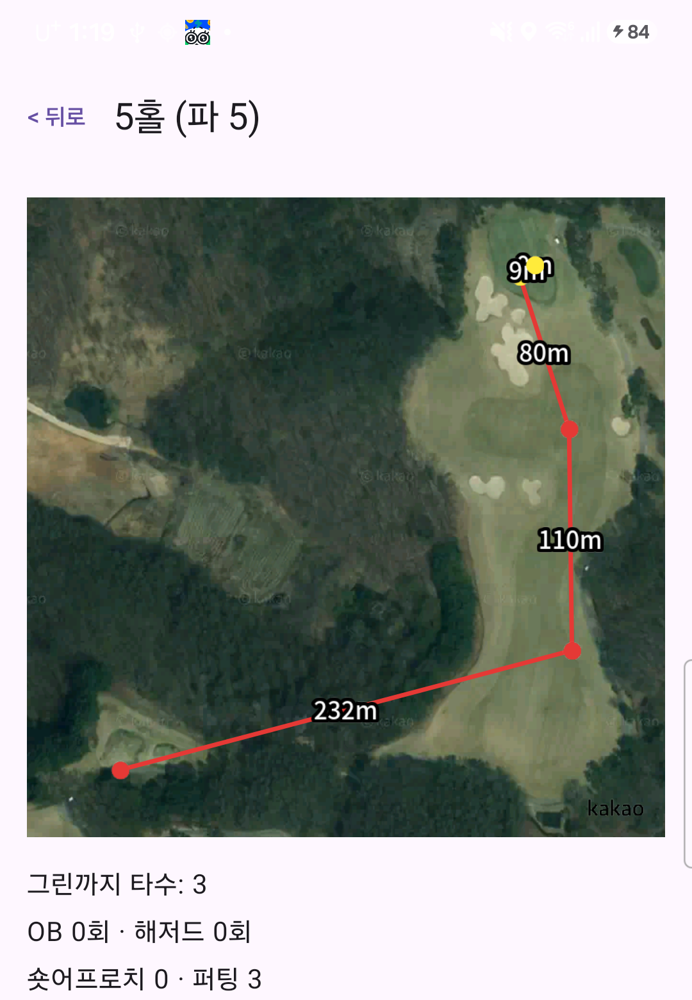

# K-Golf 사용 설명서

처음 켜는 분을 위한 5분 가이드 — 코스 등록부터 라운드 결과 확인까지.

이 앱은 라운드마다 홀별 타수, 벌타, 샷 위치를 기록하고 끝나면 스코어를 정리해서 보여주는 골프 기록 앱이에요. 아래 순서 그대로 따라 하면 5분 안에 첫 라운드를 시작할 수 있어요.

## 0. 설치하기

1. 공유받은 `app-debug.apk` 파일을 폰에 다운로드해요.
2. 파일을 눌렀을 때 "출처를 알 수 없는 앱" 경고가 뜨면 **설치 허용**을 눌러요 (앱스토어를 거치지 않고 직접 설치하는 파일이라 뜨는 정상적인 경고예요).
3. 설치가 끝나면 **K-Golf** 아이콘을 눌러 실행해요.

## 1. 자주 가는 코스 등록하기

맨 처음엔 등록된 코스가 없어요. 홈 화면 오른쪽 위 **"코스 관리"**를 눌러 **"새 코스 추가"**로 들어가면, 코스 이름과 18홀 각각의 파(3/4/5)를 정할 수 있어요.

한 번 등록해두면 다음부터는 라운드 시작할 때 목록에서 고르기만 하면 돼요.

> **TIP** 코스 이름을 누르면 평점·리뷰도 남길 수 있고, 손잡이(≡)를 꾹 눌러 드래그하면 목록 순서를 바꿀 수 있어요.

| 코스 관리 — 등록된 코스 목록 | 코스 추가 — 홀마다 파 선택 |
|---|---|
|  |  |

## 2. 라운드 시작하기

홈 화면에서 **"새 라운딩 시작!"**을 누르면 코스 목록이 뜨고, 맨 위에 스위치 두 개가 있어요. 대부분은 그냥 끈 채로 시작하면 되고, 아래 상황에서만 켜주면 돼요.

- **와치 GPS 켜기** — 라운드 중 폰을 카트에 두고 다닐 때. 워치가 대신 위치를 기록해줘요.
- **해외 코스 (구글맵 사용)** — 국내가 아닌 해외 코스일 때. 카카오맵은 국내만 지원해서, 해외에서는 이 스위치를 켜야 지도가 나와요.

코스를 누르면 바로 1홀부터 라운드가 시작돼요.

## 3. 홀마다 타수 입력하기

위성 지도 아래 버튼으로 **그린까지 타수 · OB · 해저드 · 숏어프로치 · 퍼팅**을 그때그때 +/-로 기록해요. 버튼을 누른 순간의 GPS 위치가 지도 위에 점으로 남아요.

- 🔴 빨간 점 — 그린까지 친 샷
- 🔵 파란 점 — 숏어프로치
- 🟡 노란 점 — 퍼팅

지도가 내 위치와 다르게 보이면 오른쪽 위 **"위치 조정"**을 눌러 다시 맞출 수 있고, 한 홀이 끝나면 **"다음 홀"**로 넘어가면 돼요.

## 4. 결과 확인하고 리뷰 남기기

화면 위 **"< 뒤로"**를 누르면 언제든 지금까지의 결과 화면으로 이동해요. 총타수, GIR, 홀별 기록을 볼 수 있고 **라운딩 가격·동반자·후기**도 선택으로 남길 수 있어요.

이 화면은 라운드 도중에도, 다 끝낸 뒤에도 같은 곳에서 볼 수 있어요 — 홀을 다 안 돌아도 기록은 사라지지 않아요.

## 5. 홈 화면에서 지난 기록 보기

홈 화면엔 완료한 라운드가 최신순으로 쌓여요. 코스 이름 아래로 **날짜·시간·소요시간**, 그 아래로 **그린피·동반자 이름과 각자 스코어**가 한 줄씩 표시되고, 오른쪽엔 이번 라운드 스코어 배지가 떠요 — 배지 색으로 이븐(초록) · 언더파(파랑) 같은 결과를 한눈에 구분할 수 있어요. 라운드를 누르면 그때 기록을 다시 열어볼 수 있어요.

화면 맨 아래 **백업 / 복원**으로 전체 기록을 파일 하나로 저장해두는 것도 추천해요.

*(위 화면은 실제 기록 예시라 날짜·그린피·동반자 줄은 알아보기 어렵게 흐리게 처리했어요.)*

지난 라운드의 홀 하나를 다시 열어보면, 그 홀에서 친 샷들이 지도 위에 선으로 이어지고 **샷과 샷 사이 실제 거리(m)**가 같이 표시돼요.

> **TIP** 이 거리는 GPS 좌표 사이의 직선 거리라, 고저차(오르막·내리막)는 반영되지 않아요 — 실제 체감 거리와는 조금 다를 수 있어요.

## 6. (선택) 갤럭시 워치 연동

폰만으로도 앱을 완전히 쓸 수 있어요 — 워치 연동은 라운드 중 폰을 꺼내지 않고 손목에서 타수(그린까지·퍼팅)를 올리고 싶을 때만 필요한 **선택 기능**이에요.

**준비물**
- Galaxy Watch (Wear OS) — 폰과 이미 페어링돼 있어야 해요 (갤럭시 워치 앱으로 평소 하던 연결).
- 워치용 apk — 릴리즈 Assets의 `wear-debug.apk`.

**설치 방법** — 워치는 폰처럼 apk 파일을 눌러서 바로 설치할 수 없어서, 폰에 설치 도우미 앱을 하나 더 깔아야 해요.

1. 워치에서 **설정 → 워치 정보(또는 정보) → 소프트웨어**로 들어가서 **빌드 번호**를 5~7번 연속으로 탭해요 — "개발자 모드가 켜졌습니다" 안내가 뜨면 성공.
2. 워치 **설정 → 개발자 옵션**에서 **ADB 디버깅**을 켜요.
3. 폰의 Play 스토어에서 **"Wear Installer"**(워치 apk 설치를 도와주는 앱)를 설치해요.
4. Wear Installer를 열면 페어링된 워치를 자동으로 찾아줘요 — 연결되면 `wear-debug.apk` 파일을 골라 설치를 진행해요.
5. 설치가 끝나면 워치 앱 목록에서 K-Golf 아이콘이 보여요.

> **TIP** PC와 adb(안드로이드 개발자 도구)에 익숙하면, 워치 설정의 "무선 디버깅"으로 안내되는 IP·포트·코드를 `adb pair`/`adb connect`에 입력해 직접 설치할 수도 있어요.

**사용법** — 폰에서 라운드를 시작하면 워치 화면에 자동으로 지금 홀·타수가 뜨고, 워치의 **그린까지 +/-**, **퍼팅 +/-**, **이전 홀/다음 홀** 버튼으로 조작할 수 있어요. 폰과 워치가 블루투스로 계속 통신하는 구조라, 둘이 멀어지면(폰을 카트에 두고 멀리 갈 때 등) 잠깐 반영이 늦어질 수 있지만 다시 가까워지면 자동으로 따라잡아요.

코스 선택(`설정 & 코스선택`) 화면의 **"와치 GPS 켜기"** 스위치를 켜면, 워치가 자체 GPS로 샷 위치를 기록해요 — 폰을 카트에 두고 다닐 때 유용해요.

---

즐거운 라운딩 되세요 ⛳ 처음엔 코스 하나 등록하고 연습 삼아 1홀만 입력해보는 걸 추천해요. 버튼 위치만 익숙해지면 그다음부터는 라운드 내내 폰을 몇 번 안 봐도 될 만큼 단순해요.
